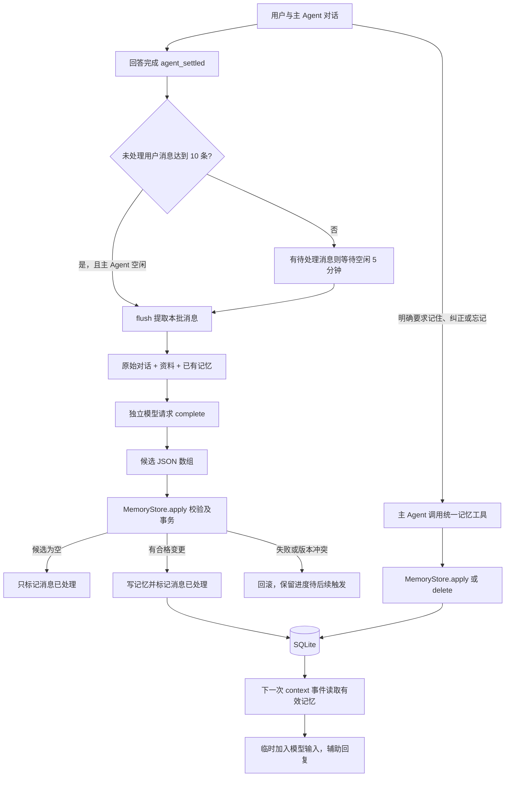
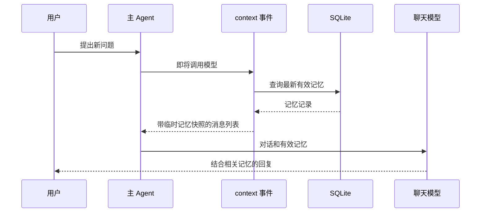

# 从 JavaScript 视角读长期记忆代码

这套功能的主线是：收集消息，调用模型得到候选，校验候选并写入 SQLite，在后续模型请求前读取有效记忆。先理解这条主线，再看类型和并发处理，会更容易。

## 1. 文件阅读顺序

| 顺序 | 文件 | 先看什么 |
| --- | --- | --- |
| 1 | [扩展入口](../.pi/extensions/fatloss-agent.ts) | 创建资料仓储、复用连接创建记忆仓储、注册工具和事件 |
| 2 | [运行时](../src/memory-runtime.ts) | `registerMemoryRuntime()` 怎样接 SDK；`MemoryCoordinator.flush()` 怎样完成一次提取 |
| 3 | [记忆定义](../src/memory.ts) | `MEMORY_EXTRACTION_PROMPT`、候选结构和 `parseMemoryCandidates()` |
| 4 | [记忆存储](../src/memory-store.ts) | `pending()`、`apply()`、`delete()`、`context()` |
| 5 | [记忆工具](../src/tools/memories.ts) | 主 Agent 怎样即时查询、记住、纠正、失效和删除 |
| 6 | [评估入口](../src/memory-evaluation.ts) | 用虚构对话请求真实模型，再交给同一存储逻辑验证 |

第一遍可以先跳过日期正则、SQL 字段列表和泛型；它们不是理解业务流程的前提。

## 2. 整体流程



后台提取和即时工具有不同的入口，但最终调用同一套记忆存储逻辑。SQLite 不直接与模型对话，记忆也不会自动改变模型权重；应用每次把相关数据放进模型输入，模型才有机会使用它。

## 3. 一次自动提取到底做什么

### 触发：`settled()` 与 `armIdle()`

`agent_settled` 表示本次 Agent 运行已经结束。`settled()` 检查未处理用户消息数量，达到 10 条且空闲就调用 `flush()`，否则为有待处理消息的会话安排 5 分钟计时。`input()` 会取消计时；回答结束后再重新安排。

这里没有一个简单的 `counter++`。程序从当前分支取原始消息，再让 `store.pending()` 排除启用前、已处理、已被要求忘记的来源。处理标记保存在 SQLite，所以恢复对应会话后仍能判断哪些话处理过。分支以外的消息不会被读进来，工具结果也不计数。

### 准备：`flush()`

可以先把它读成下面的 JavaScript 伪代码；这里省略取消、版本检查和错误处理：

```js
async function flush() {
  const messages = readMessages();
  const pending = store.pending(messages).slice(0, 10);
  if (pending.length === 0) return;

  const input = buildInput(messages, pending, profile, existingMemories);
  const text = await extract(JSON.stringify(input));
  const candidates = JSON.parse(text);

  store.apply(candidates, pending, revision, pending);
}
```

真正代码里，输入包括未处理消息 ID、含少量邻近旧消息的原始对话、现有 `profile`、全部已有记忆和已忘记来源的指纹。邻近旧消息与助手回答帮助理解上下文，但只有 `pendingMessageIds` 指定的用户消息可用作新增证据。

目前提取时读的是 `store.all()`，包括失效记录，以帮助去重或判断重新生效；它还没有语义检索或复杂筛选。正常回复使用的则是有数量和长度限制的有效记忆快照。

### 判断：`complete()` + `MEMORY_EXTRACTION_PROMPT`

SDK 接线层的核心代码是：

```ts
const response = await current.modelRegistry.complete(current.model, {
    systemPrompt: MEMORY_EXTRACTION_PROMPT,
    messages: [{ role: "user", content: input, timestamp: store.now() }],
}, { signal });
```

这段没有复杂 TS：对象、数组、函数调用、`await` 都是 JavaScript。它复用当前模型及认证，但单独发起请求，使用提取专用提示词，不驱动主 Agent 的工具循环。

模型负责判断：“这是不是用户自己的事实”“未来有没有用”“是不是旧信息的纠正”。程序没有硬编码所有可能的句子。

| 对话 | 语义判断依据 |
| --- | --- |
| 蛋白质有什么作用？ | 普通知识问题，没有用户事实 |
| 最快多久能达标？ | 问时间不能直接推出焦虑或急切 |
| 助手建议散步，用户未接受 | 助手建议不是用户陈述 |
| 我不喜欢被催促，请温和提醒 | 明确、可用于后续沟通的个人偏好 |
| 我现在改上日班了 | 联系已有夜班记录，可提出更新；不凭空编造新作息细节 |

涉及 `profile` 已建模字段时，不在记忆里另存一套数值或安排。这里同样主要依靠提示词引导语义判断，程序没有能完美判定“这段话是否属于资料字段”的独立分类器。

### 输出：候选而非整段摘要

模型输出可能是：

```json
[
  {
    "action": "create",
    "content": "不喜欢被催促，希望提醒温和一些",
    "category": "偏好",
    "evidence": [
      { "messageId": "u123", "quote": "我不喜欢被催促，希望你提醒我时温和一点" }
    ],
    "expiresAt": null
  }
]
```

也可能是 `[]`。这表示“检查过了，没有合格的记忆”，与请求失败、输出格式错误不同。

## 4. `apply()` 怎样把模型建议变成正式数据

`apply()` 是最重要的写入方法：

```ts
apply(
    candidates: unknown,
    sources: MemoryMessage[],
    expectedRevision: number,
    processed: MemoryMessage[] = [],
): MemoryChanges
```

先忽略冒号后面的类型，它就是一个接收四个参数、返回统计结果的函数：

| 参数 | 含义 |
| --- | --- |
| `candidates` | 模型提出的变更，尚不能直接信任 |
| `sources` | 本次允许拿来引用的真实用户消息 |
| `expectedRevision` | 发起提取时看到的数据库版本 |
| `processed` | 本批已检查完成的消息，不限于被选作证据的那些 |

它依次做结构校验、全局版本检查、证据核对、目标和时间检查，然后执行 SQL。`BEGIN IMMEDIATE` 到 `COMMIT` 之间只有同步数据库操作，不会开着事务等待模型返回。任何候选失败都会回滚。

最关键的空结果逻辑，简化后是：

```js
transaction(() => {
  for (const candidate of candidates) {
    validateAndWrite(candidate);
  }

  for (const message of processed) {
    markProcessed(message.key);
  }
});
```

当 `candidates` 是 `[]` 时，第一个循环不运行，第二个仍然运行。因此没有新记忆，但下次不会反复处理同一批问答。

证据核对会确认 ID 指向真实用户消息、原话确实包含在该消息中，以及来源未被要求忘记。它不能证明“原话支持这个结论”：引用“不喜欢跑步”却总结成“不喜欢运动”，结构和来源都可能合法，语义仍然错了。真实模型评估和用户纠正负责发现这类问题。

去重也分两层：模型判断语义重复；代码只把全半角等兼容字符和空白规范化后，检查同类别、同内容的有效记录。代码不会仅凭字符串比较识别所有同义句。

## 5. 三个编号与四张表

### 编号分别保护什么

| 编号 | 所在位置 | 解决的问题 |
| --- | --- | --- |
| `generation` | 调度器内存 | 已切换或停止会话，旧请求晚返回不能再保存 |
| `revision` | `memory_state` | 模型请求期间任意记忆发生变更，整份旧快照结果需要重新提取 |
| `version` | 每条记忆 | 工具查询后记录被别人修改，不能拿旧版本更新或删除 |

例子：后台拿到 revision=5，开始提取；用户此时删除一条记忆，revision 变成 6；后台返回时仍携带 5，`apply()` 发现不一致，拒绝写入。它不会尝试让模型的旧结论压过用户的新操作。

`running` 保存当前提取 Promise，重复触发时返回同一个 Promise。`AbortController` 负责取消通知，`Promise.race()` 让调度器能及时结束等待。`Promise.race()` 自身不会取消另一个请求。

### 表分别存什么

| 表 | 内容 |
| --- | --- |
| `memories` | 正文、类别、证据、状态、到期时间、版本等 |
| `memory_state` | 首次启用时间和全局 revision |
| `memory_processed_sources` | 已处理消息的指纹，不保存正文 |
| `memory_forgotten_sources` | 已忘记来源的指纹，不保存原话 |

到期与删除不同：`list()` 按到期时间过滤，`fromRow()` 将到期记录展示为失效，因此不需要定时改所有到期行；删除则真正移除该条记忆正文，并记住旧来源指纹，防止再次导入。原始 pi 聊天历史不在这个删除范围里。未来新消息有新的来源指纹，可以形成新记忆。

## 6. 记忆怎样影响回复



`store.context()` 按更新时间取最多 30 条，限制文本长度，仅附最新证据。数据太多时会标记“未完整加载”，主 Agent 再通过 `list_memories` 按类别或文本查询、翻页。

`context` 事件返回的是本次模型请求的临时消息列表，不是调用 `sendUserMessage()` 向持久化历史不断追加快照。所以下一轮会重新读取数据库，更新和删除有机会立即反映到新请求里。模型是否正确使用记忆，还取决于模型遵守聊天系统提示词。

即时工具由 `defineTool()` 定义。可以把它看成暴露给模型的业务函数：`description` 解释何时使用，`parameters` 描述参数形状，`execute` 执行 JS 逻辑。工具入口再调用 `store.apply()` 或 `store.delete()`。明确请求的语义识别主要由主 Agent 根据工具说明完成，不是每个工具内部再启动一个意图模型。

## 7. 把常见 TS 写法翻译成 JS 思路

### `interface`、`type`：描述形状

```ts
interface MemoryMessage {
    id: string;
    text: string;
    role: "user" | "assistant";
}
```

它告诉编辑器：这个对象必须有 id、text，role 只能是两个字符串之一。不会在运行时创建对象，也不会自动验证接口或模型返回的数据。

`role: "user" | "assistant"` 是联合类型；`MemoryMessage[]` 是该类型组成的数组。`type` 还方便给联合类型和函数类型取名字。

### 函数签名：先看参数名和函数体

```ts
function parseMemoryCandidates(value: unknown): MemoryCandidate[] {
    if (!Value.Check(candidatesSchema, value)) throw new Error("格式不合法");
    return value as MemoryCandidate[];
}
```

去掉类型部分后，其运行逻辑就是：

```js
function parseMemoryCandidates(value) {
  if (!Value.Check(candidatesSchema, value)) throw new Error("格式不合法");
  return value;
}
```

`unknown` 表示尚不知道形状，不能随便取属性。`as MemoryCandidate[]` 是告诉 TS 按这个类型看待数据，不是转换，也不是校验。真正运行的是 `Value.Check()`。

代码中查询 SQLite 后的 `as unknown as MemoryRow[]` 也是类型断言，用来接上驱动较宽泛的结果类型；它不会检查数据库有没有损坏或数据结构是否真实符合声明。

### `Type.Object()` 与 `Static<typeof schema>`：两个层次

```ts
const schema = Type.Object({ content: Type.String() });
type Candidate = Static<typeof schema>;
```

第一行是普通 JS 函数调用，创建运行时 schema 对象，供参数说明和 `Value.Check()` 使用。第二行从 schema 推导 TS 类型，编译后消失。这样运行时规则与静态类型不用分别维护。

### `action` 分支会帮助 TS 缩小范围

`MemoryCandidate` 有 create、update、invalidate 三种形状。执行 `if (candidate.action === "invalidate")` 后，TS 知道现在是哪一种，就不会要求你访问这个分支没有的 content。

`if` 仍是普通 JS 判断；“进入分支后更清楚对象形状”是 TS 提供的额外帮助。

### `<T>`：把输入与输出的类型联系起来

```ts
private transaction<T>(run: () => T): T
```

读作：接收一个无参数回调，回调返回什么类型，transaction 就返回什么类型。`T` 是类型占位符，不是运行时变量，不代表循环或额外的异步流程。

### 构造器参数属性：少写成员赋值

```ts
constructor(readonly db: DatabaseSync, readonly now: () => number = Date.now)
```

大致对应：

```js
constructor(db, now = Date.now) {
  this.db = db;
  this.now = now;
}
```

这里不是简单删掉类型就完全还原，因为 TS 的“参数属性”会生成成员赋值。`readonly` 主要约束 TS 代码不要重新给成员赋值，不会把对象 `Object.freeze()`，也不妨碍调用数据库方法。

代码里的 `private` 主要是 TS 访问限制，与 JavaScript 的 `#privateField` 不同。它帮助组织接口，但不是运行时安全隔离。

### `?`、`!`、`void` 不要混在一起看

| 写法 | 如何理解 |
| --- | --- |
| `expiresAt?: string` | TS：属性可以不提供 |
| `string \| null` | TS：值可以是字符串或 null |
| `private running?: Promise<void>` | TS：可选成员，若存在就是一个完成后不返回业务值的 Promise |
| `before!` | TS：告诉编译器此处不是 null/undefined；自身不检查，前面的逻辑必须保证它 |
| `ctx?.model` | JS：可选链，ctx 不存在时返回 undefined |
| `options.schedule ?? scheduleTask` | JS：只有左边是 null/undefined 才用默认值 |
| `void this.flush()` | JS：调用函数并丢弃返回值；不会等待、不会取消 Promise |
| `async`、`await`、`Promise.race()` | JS：异步机制，不是 TS 独有 |
| `{ ...fields }`、解构、`.at(-1)` | JS：对象展开、解构和数组方法 |

`as const` 让 TS 保留字面量并限制修改，不会在运行时冻结数组。`typeof MEMORY_CATEGORIES[number]` 在类型位置表示“取这个数组所有元素可能的类型”，不是运行时读取某个名为 number 的下标。

## 8. 怎样判断自己读懂了

第一遍只追这条调用链：`agent_settled → settled → flush → complete → apply → context`。看到类型注解先跳过，关注函数调用、条件分支和数据返回。

第二遍看三个数据形状：原始消息 `MemoryMessage`、模型候选 `MemoryCandidate`、正式记录 `Memory`。它们描述同一条信息在不同阶段被附加了哪些证据和管理字段。

第三遍再看取消、版本号、日期和事务。这些代码主要解决异步操作与持久化的一致性，即使用 JavaScript 实现也需要；不要把所有复杂度都归因于 TS。

验证入口见 [长期记忆验证](memory-evaluation.md)。自动测试检查程序机制；真实模型评估检查是否理解对话。两者通过标准不同，不能用“能入库”代替“记得对”。
